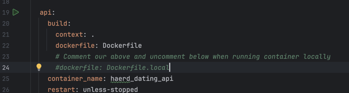

# Haerd Dating Api

The backend for the Haerd dating app built with:
- **Language**: Go (Chi router + SQL Boiler)
- **Database**: PostgreSQL
- **Blob Storage**: AWS S3
- **Containerization**: Docker & Docker Compose

---
## 📦 Requirements

- [Go 1.22+](https://go.dev/)
- [Docker & Docker Compose](https://docs.docker.com/get-docker/)

---


## 🚀 Running with Docker (recommended)

1. Create a .env file at the root of the repository and add the contents of the "Haerd Dating .env" file on the google drive(Haerd Limited/Engineering/Env Files)
2. Update the docker-compose file as instructed below but DON'T commit these changes. This is only for running locally.

3. Run the below commands from the root of the repository:
```bash
Make deps
Make build
```

The API will be available at http://localhost:8080.
