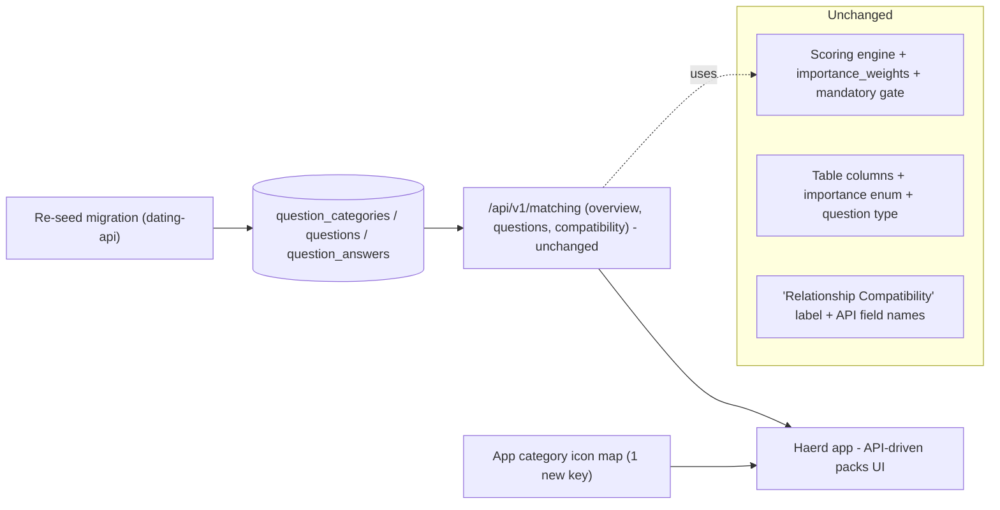

# Question Packs Content Refresh

Rebuild the compatibility question bank so the packs reflect what relationship science says actually predicts long-term compatibility, per [COMPATIBILITY_QUESTIONS_REVIEW.md](COMPATIBILITY_QUESTIONS_REVIEW.md). This is a **content + category-structure** change only: no changes to the scoring algorithm, the schema's weighting model, the user-facing score label, or admin tooling.

## Goal

Replace today's OkCupid-clone bank (lots of low-signal "lifestyle preference" noise) with an evidence-based set: keep the high-signal dealbreaker/value-congruence questions, cut/reframe the weak ones, add the high-signal constructs that are missing (emotional stability, attachment, sexual values, financial transparency, conflict-repair, openness), and restructure the packs accordingly. Because content is fully API-driven, shipping a re-seed migration makes the new packs live end-to-end through the existing API and app.

Success = the new bank is live; the app renders the restructured packs (with a proper icon for the new pack); the existing answer flow, sequential locking, and compatibility computation work unchanged on the new content.

## Background and Context

- The 50 questions / 10 packs are seeded in [migrations/20251022211336_create_matching_schema_and_seed.sql](../../migrations/20251022211336_create_matching_schema_and_seed.sql). The review verdicts: keep ~22, reframe ~7, de-weight ~5, replace ~10, add ~10 new.
- Content is **fully API-driven** on the app: question text, answer labels, and category display names all come from the backend. A content rewrite therefore needs only `dating-api` migrations.
- The app **hardcodes category icons by `category_key`** in `Haerd-dating-app/dating-app/src/components/question-packs/question-pack-category-icon.tsx`. New category keys fall back to a generic icon, so the one new pack needs an icon entry.
- **Pre-launch**: `user_answers` has no production data, so we can re-seed content cleanly (no ID-preserving gymnastics).
- Question management lives only in SQL migrations — there is no admin CRUD (confirmed across the admin dashboard).

## Constraints

- **No scoring/schema change.** Leave the geometric-mean engine, `importance_weights`, mandatory gate, and the `questions`/`question_answers` columns as-is. Keep `type = 'structured'` and the 5 importance levels (`irrelevant`…`mandatory`) so the app's Zod schemas and scoring SQL are untouched.
- **No score relabel** ("Relationship Compatibility" stays) and **no API field renames** (`overall_score`, `match_percent`) — renaming would break the app's strict schemas.
- **API contract stable**: same endpoints, same response shapes; only the seeded rows change.
- Follow repo conventions in [AGENTS.md](../../AGENTS.md): goose up/down migrations, `make migrate-up`, `make entity`, `make lint`, `make build`; app side must pass `bun run ready`.
- Keep PII/logging hygiene unaffected (no logging changes in scope).

## Design Decisions and Tradeoffs

### Decision 1 — Content-only; defer weighting, relabel, admin CRUD

| Approach | Pros | Cons | Verdict |
|---|---|---|---|
| **Content rewrite + category restructure only** | Fast, lowest risk, highest content value; app auto-picks up via API | The % can still let a low-tier "very important" outrank a high-tier "somewhat" (no editorial weighting) | **Accept** |
| Add editorial per-question weighting now | Makes the % genuinely meaningful | Schema + scoring-engine change; larger blast radius | Reject (defer as fast-follow) |
| Add relabel + admin CRUD now | Honest UX; future edits without migrations | App copy + multi-repo build; out of stated scope | Reject (defer) |

Rationale: user-selected scope. The known limitation (no editorial weighting) is carried as an accepted risk and a recommended immediate follow-up.

### Decision 2 — Clean re-seed (pre-launch), not incremental edits

| Approach | Pros | Cons | Verdict |
|---|---|---|---|
| **Wipe + re-seed content tables in one migration** | Simple, clean ordering; sidesteps the "scoring ignores `is_active`" gotcha entirely (no orphan answers) | Would be unsafe if data existed | **Accept** (safe: pre-launch) |
| ID-preserving reword/deactivate per item | Required if data existed | Fragile, verbose, unnecessary here | Reject |

Approach: update existing category display names, insert the one new category, delete existing questions (answers cascade), insert the new question + answer set with curated per-category `sort_order`. Reversible `-- +goose Down` restores the prior seed.

### Decision 3 — Keep category keys stable; add exactly one new key

| Approach | Pros | Cons | Verdict |
|---|---|---|---|
| **Rename display names only; reuse existing keys; add one new key (`temperament_emotional_health`)** | Single app icon change; no client key-coupling breakage | New key still needs an icon; slightly stale key names (e.g. `lifestyle_cleanliness` now shows "Lifestyle") | **Accept** |
| Rename keys to match new names | Cleaner semantics | Breaks app icon map + any key-coupled client logic; more churn | Reject |

Net category set (11): keep `faith_values`, `relationship_intent`, `kids_family`, `substances`, `conflict_communication`; rename display names of `monogamy_boundaries`→"Monogamy & Intimacy", `money_work`→"Money & Finances", `politics_tolerance`→"Politics & Worldview", `time_ambition`→"Openness & Ambition", `lifestyle_cleanliness`→"Lifestyle"; add `temperament_emotional_health`→"Temperament & Emotional Health".

### Decision 4 — Pets dropped from packs; "pets as profile attribute" deferred

Moving pets to a profile attribute is profile/app feature work (new field + onboarding/edit/discover UI), outside content-only scope. Pets is dropped from the Lifestyle pack and recorded as a future profile project.

## Architecture Overview

Content flows one direction; only the seeded rows and one app icon entry change.

## Phases

### Phase 1 — Author the new question bank (content spec) — STEEL THREAD (part 1)

- **Description:** Produce the authoritative content spec: final categories, every question's text, answer options (with variance — no zero-variance items like the old "integrity" question), per-category `sort_order`, and which items are dealbreaker-eligible. Reconcile the two review ambiguities: (a) keep "Substances" as its own pack vs fold into Lifestyle; (b) where emotional-regulation lives (Temperament vs Conflict). Derived from review sections 3 (per-question verdicts) and 5 (best-questions set).
- **Dependencies:** none.
- **Key decisions:** Decision 1, 3, 4.
- **Validation criteria:** stakeholder sign-off on the spec; every question traces to a review verdict/tier; every multiple-choice answer set has genuine variance; dealbreaker-eligible items flagged; per-pack counts and ordering fixed.
- **Doc deliverables:** content spec committed to the repo (e.g. alongside the review doc); note in [COMPATIBILITY_QUESTIONS_REVIEW.md](COMPATIBILITY_QUESTIONS_REVIEW.md) of what is being implemented.
- **Name quality:** self-contained — "Author the new question bank."

### Phase 2 — Re-seed migration (dating-api) — STEEL THREAD (part 2)

- **Description:** Add a goose migration that renames category display names, inserts the new category, deletes the old questions, and inserts the new questions + answer options with curated `sort_order`, per the Phase 1 spec. No column/enum/engine changes. Reversible down-migration restores the previous seed. After this runs, the new packs are live via the existing API and render in the existing app.
- **Dependencies:** Phase 1.
- **Key decisions:** Decision 2, 3, 4.
- **Validation criteria:** `make migrate-up` succeeds on a fresh DB; `make migrate-down` then up again is clean (reversible); `GET /matching/overview` returns the new packs in intended order; `GET /matching/questions?category=…` returns the new questions/answers in `sort_order`; `POST /matching/answers` + sequential-answering validation still works; existing `service_test.go` passes; `make entity` shows no entity diff (no schema change); `make lint` and `make build` pass; manual: answer one pack end-to-end locally.
- **Doc deliverables:** migration file documented inline; update [internal/README.MD](../../internal/README.MD) only if any pack-count/feature description references the old set.
- **Name quality:** "Re-seed compatibility question packs."

### Phase 3 — App alignment: category icon + copy check

- **Description:** Add an icon for the new `temperament_emotional_health` key in `Haerd-dating-app/dating-app/src/components/question-packs/question-pack-category-icon.tsx` (optionally give `faith_values` a real icon while here, since it currently defaults). Confirm no other hardcoded coupling breaks (importance enum unchanged; display names are API-driven; renamed packs need no copy change).
- **Dependencies:** Phase 2 (final category keys known).
- **Key decisions:** Decision 3.
- **Validation criteria:** new pack renders a sensible icon (not the generic fallback); pack list and cards show the new display names; question/answer flow renders; `bun run ready` passes; manual smoke of the question-packs, pack, review, and edit screens.
- **Doc deliverables:** none.
- **Name quality:** "App category icon for the new pack."

### Phase 4 — End-to-end verification, docs, and deferral record

- **Description:** Verify the full answer → compatibility → breakdown-modal flow on the new packs (categories, highlights, badges, sequential locking, discover `minOverlap` behavior). Update the review doc with an "Implemented vs Deferred" status and record the deferred follow-ups.
- **Dependencies:** Phase 2, Phase 3.
- **Key decisions:** Decision 1 (records deferred items).
- **Validation criteria:** answering enough questions unlocks and computes a score; breakdown modal shows the new category names; a deliberate "must have" mismatch still gates correctly; deferred-work list captured (editorial weighting, score relabel, pets-as-profile-attribute, admin CRUD).
- **Doc deliverables:** status/changelog note appended to [COMPATIBILITY_QUESTIONS_REVIEW.md](COMPATIBILITY_QUESTIONS_REVIEW.md).
- **Name quality:** "Verify and document the refreshed packs."

**Steel thread = Phases 1 + 2.** This is the thinnest viable end-to-end slice: a finalized content spec plus the re-seed migration makes the new packs live through the unchanged API and the API-driven app — proving the whole content pipeline without touching scoring or app code. Phase 3 widens (icon polish); Phase 4 hardens (QA + docs + deferral record).

## Risks and Open Questions

- **No editorial weighting (accepted).** A low-tier item marked "very important" can still outweigh a high-tier "somewhat." Mitigation: recommend editorial per-question weighting as the immediate next project; until then the dealbreaker gate (mandatory) carries the strongest signal.
- **Category ordering relies on insertion order** — there is no `sort_order` on `question_categories`, and `GetQuestionCategories()` has no `ORDER BY`. Decide in Phase 2 whether to accept natural ordering (new pack appears last) or re-seed all categories in the intended order (changes ids, safe pre-launch). A category `sort_order` column would be a tiny schema add and is flagged as optional, out of current scope.
- **Substances pack and emotional-regulation placement** — resolve in Phase 1; the review's section-5 list is illustrative, and the content spec is authoritative.
- **Pets** — dropped from packs here; "pets as a profile attribute" is a separate future profile project.
- **App icon coupling** — the only hard app dependency on category keys; covered by Phase 3.

## References

- [COMPATIBILITY_QUESTIONS_REVIEW.md](COMPATIBILITY_QUESTIONS_REVIEW.md) — evidence base and per-question verdicts (serves as the research artifact for this project).
- [migrations/20251022211336_create_matching_schema_and_seed.sql](../../migrations/20251022211336_create_matching_schema_and_seed.sql) — current seed.
- [migrations/20260309140000_reword_communication_question_answers.sql](../../migrations/20260309140000_reword_communication_question_answers.sql) — reword migration pattern.
- [internal/compatibility/service.go](../../internal/compatibility/service.go), [internal/compatibility/storage/repository.go](../../internal/compatibility/storage/repository.go) — scoring (unchanged, for context).
- [internal/api/compatibility/dto/response.go](../../internal/api/compatibility/dto/response.go), [internal/http/router/router.go](../../internal/http/router/router.go) — API surface (unchanged).
- `Haerd-dating-app/dating-app/src/components/question-packs/question-pack-category-icon.tsx` — the one app coupling to category keys.
- [AGENTS.md](../../AGENTS.md) — migration/build conventions.

## Next Steps

1. Commit this plan to a branch as a durable artifact. The evidence/research lives in [COMPATIBILITY_QUESTIONS_REVIEW.md](COMPATIBILITY_QUESTIONS_REVIEW.md), which serves as this project's research document.
2. For each named phase, run `/create-implementation-plan` to produce the code-level plan, then `/critique-plan` to stress-test it before implementing — starting with the steel thread (Phase 1, then Phase 2).
3. Keep this project plan as the source of truth for *what* and *why*; implementation plans handle *how*.
