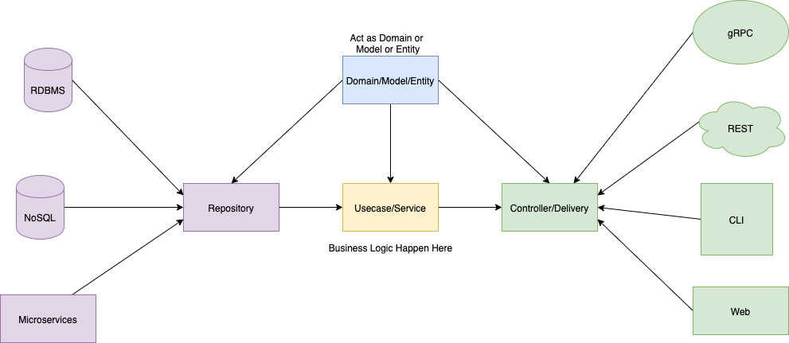

# How to contribute to this repository 

This document describes Haerd's standard way of developing and contributing to this repository. This is written so that everyone creates features in a unified and consistent way. It describes the standard steps involved when creating a new feature from scratch that doesn't utilise the existing services and also the steps involved when you're creating a new feature that does utilise them. It also describes things such as how to make database changes, 

Notes:
- '//...' represents omitted code to make the examples easier to understand

## Table of Contents
* [Architecture Overview](#architecture-overview)
* [Creating a new feature](#creating-a-new-feature)
* [FAQ](#faq)

## Architecture Overview



In this repository we follow a clean/domain driven design architecture. Mentally you can think of the API/repository being split into 3 layers:
- **The Handler Layer** - Contains handler methods that handles requests sent to the router found in 'internal/http/router/router.go'. Responsible for doing things like :

1. Deserialising JSON into Go request structs and mapping these request structs to the relevant domain model which is then passed as an argument to service method calls. 

```golang
//code from 'internal/api/interaction/handler.go'.

func (h *handler) Create() http.HandlerFunc {
	return func(w http.ResponseWriter, r *http.Request) {
        //...
		var req dto.SwipesRequest

		// Validates and deserialises the JSON request
		err := request.DecodeAndValidate(r.Body, &req)
        //...

        //Notice how we map requests to domain objects and then pass the domain object to the service method
		result, err := h.interactionService.CreateSwipe(ctx, mapper.SwipesRequestToDomain(req, userID))
        //...
    }
}
```
2. Mapping service method call results into response objects which are included in the response body

```golang
func (h *handler) Create() http.HandlerFunc {
	return func(w http.ResponseWriter, r *http.Request) {
        //...
		result, err := h.interactionService.CreateSwipe(ctx, mapper.SwipesRequestToDomain(req, userID))
		if err != nil {
			h.handleServiceErrorResponse(w, r, "CreateSwipe", err)
			return
		}

		render.Json(w, http.StatusCreated, mapper.MapToSwipesResponse(result))
	}
}

```

3. Mapping internal layer(service & repository) errors to the correct status code and user friendly error message

```golang
//code from 'internal/api/interaction/handler.go'.

func mapErrorsToStatusCodeAndUserFriendlyMessages(err error) (int, string) {
	switch {
	case errors.Is(err, convostorage.ErrClientMsgIDNotUnique):
		return http.StatusBadRequest, "Client message ID must be unique"
	case errors.Is(err, interaction.ErrPromptIDRequiredToLikeUser):
		return http.StatusBadRequest, "Prompt ID is required to like a profile"
	case errors.Is(err, interaction.ErrSelfLike):
		return http.StatusBadRequest, "As much as we promote self love, you cannot like yourself"
	case errors.Is(err, interaction.ErrInvalidAction):
		return http.StatusBadRequest, fmt.Sprintf("Invalid action. Action must be '%s','%s' or '%s'", constants.ActionLike, constants.ActionPass, constants.ActionSuperlike)
	case errors.Is(err, interaction.ErrMissingRequiredFieldsForLikeWithMessage):
		return http.StatusBadRequest, "Sending a like with a message also requires message_type, message,prompt_id and a generated client_msg_id"
	case errors.Is(err, interaction.ErrLikedAVhwUser):
		return http.StatusBadRequest, "You can only superlike or pass a Voices Worth Hearing user"
	case errors.Is(err, interaction.ErrWeeklySuperlikeLimitReached):
		return http.StatusForbidden, "You've already used your superlike this week"
	case errors.Is(err, interaction.ErrInvalidDirection):
		return http.StatusBadRequest, "Invalid direction. Direction must be 'incoming'"
	case errors.Is(err, storage.ErrUserDoesNotExists):
		return http.StatusNotFound, "User does not exist"
	case errors.Is(err, commonErrors.ErrInvalidDOBFormat):
		return http.StatusBadRequest, messages.InvalidDobMsg
	case errors.Is(err, storage2.ErrAlreadySwiped):
		return http.StatusConflict, "You've already swiped on this user"
	default:
		return http.StatusInternalServerError, messages.InternalServerErrorMsg
	}
}

func (h *handler) handleServiceErrorResponse(w http.ResponseWriter, r *http.Request, handlerName string, err error) {
	...
	statusCode, errMsg := mapErrorsToStatusCodeAndUserFriendlyMessages(err)
	...
	render.Json(w, statusCode, commonMappers.ToSimpleErrorResponse(errMsg))
}
```

- **The Service Layer** - Sits in between the **handler layer** and **repository layer**. It's where business logic is applied to domain models and these domain models are converted to and from entity objects. Services can also carry out more complex request validation for when "github.com/go-playground/validator/v10" is not enough.

```golang
//code from 'internal/interaction/service.go'

//Notice how the service method parameter is a domain model 'domain.Swipe'
func (is *service) CreateSwipe(ctx context.Context, swipe domain.Swipe) (string, error) {
	//...
	matchable, err := is.interactionRepo.CheckIfMatchable(ctx, swipe.UserID, swipe.TargetUserID)
	if err != nil {
		return "", fmt.Errorf("check if matchable userID=%s targetUserID=%s: %w", swipe.UserID, swipe.TargetUserID, err)
	}

	//...
    // Notice how a function has been made to further validate the domain model incase the handler layer couldn't do all checks.
	err = is.validateSwipe(ctx, swipe, matchable)
	if err != nil {
		return "", fmt.Errorf("validate swipe userID=%s : %w", swipe.UserID, err)
	}

	switch swipe.Action {
	case constants.ActionLike, constants.ActionSuperlike:
		if swipe.Action == constants.ActionSuperlike {
			//...
		}

		if !matchable {
			//...
            //Notice how the swipe domain model is converted/mapped into an entity object before being passed to repository methods.
            err = is.interactionRepo.InsertSwipe(ctx, mapper.SwipeToEntity(swipe), tx.Raw())
			if err != nil {
				return "", fmt.Errorf("insert swipe userID=%s : %w", swipe.UserID, err)
			}

			return ResultSent, nil
		}
		//...

		targetUserSentMeALikeWithAMessage := targetUserSwipe.Message.Valid && targetUserSwipe.MessageType.Valid && targetUserSwipe.IdempotencyKey.Valid
		if targetUserSentMeALikeWithAMessage {
			//...
		}

		userRepliedToLiked := swipe.Message != nil
		if userRepliedToLiked {
			//...
		}

		//...

		return ResultMatched, nil

	case constants.ActionPass:
		//...
		return ResultPassed, nil
	}

	return "", fmt.Errorf("%w: %s", ErrInvalidAction, swipe.Action)
}
```

- **The Repository Layer** - The closest layer to the database. Contains methods that are communicate with the database. Responsible for providing entity objects to the *service layer* so business logic can be applied to its domain model equivalent. We generate the entity objects using 'github.com/aarondl/sqlboiler/v4' and the generate files and objects can be found in the 'internal/entity' folder.

```golang
//Code from 'internal/interaction/storage/repository.go'

//Notice how this get method takes parameters and returns the sqlboiler generated entity object.
func (is *repository) GetSwipeByActorIDAndTargetID(ctx context.Context, actorID, targetID string) (*entity.Swipe, error) {
	s, err := entity.Swipes(
		entity.SwipeWhere.ActorID.EQ(actorID),
		entity.SwipeWhere.TargetID.EQ(targetID),
	).One(ctx, is.db)
	if err != nil {
		return nil, err
	}

	return s, nil
}

// Notice how this insert method takes a sqlboiler generated entity object and calls it's Insert method.
func (is *repository) InsertSwipe(ctx context.Context, swipe entity.Swipe, tx *sql.Tx) error {
	err := swipe.Insert(ctx, tx, boil.Infer())
	if err != nil {
		var pqErr *pq.Error
		if errors.As(err, &pqErr) && pqErr.Code == "23505" {
			switch pqErr.Constraint {
			case "swipes_actor_target_uniq":
				return ErrAlreadySwiped
			}

			return err
		}

		return err
	}

	return nil
}
```

Remember that handlers depend on and import services...  

```golang
//code from 'internal/api/interaction/handler.go'

type handler struct {
	logger             *zap.Logger
	interactionService interaction.Service
}

func NewInteractionHandler(
	logger *zap.Logger,
	interactionService interaction.Service,
) Handler {
	return &handler{
		logger:             logger,
		interactionService: interactionService,
	}
}
```

...Services depend on and import other services and repositories...
```golang
//code from 'internal/interaction/service.go'

type service struct {
	logger              *zap.Logger
	profileService      profile.Service
	conversationService conversation.Service
	interactionRepo     storage.InteractionRepository
	discoverService     discover.Service
	safetyService       safety.Service
	uow                 uow.UoW
	hub                 realtime.Broadcaster
	notificationService notification.Service
}

func NewInteractionService(
	logger *zap.Logger,
	profileService profile.Service,
	conversationService conversation.Service,
	interactionRepo storage.InteractionRepository,
	discoverService discover.Service,
	safetyService safety.Service,
	uow uow.UoW,
	hub realtime.Broadcaster,
	notificationService notification.Service,
) Service {
	return &service{
		logger:              logger,
		interactionRepo:     interactionRepo,
		profileService:      profileService,
		conversationService: conversationService,
		discoverService:     discoverService,
		safetyService:       safetyService,
		uow:                 uow,
		hub:                 hub,
		notificationService: notificationService,
	}
}
```

...and repositories depend on a database. 

```golang
//code from 'internal/interaction/storage/repository.go'
type repository struct {
	db *sqlx.DB
}

func NewInteractionRepository(db *sqlx.DB) InteractionRepository {
	return &repository{
		db: db,
	}
}
```

All of the above allows us to follow SOLID principles and makes it easier to collaborate with others. 


Everything, like other golang codebases, is initialised and starts from the main.go file. Note that not everything has to be instantiated directly in the main.go file. Sometimes things can be abstracted into their own folders and then be imported instead to keep the main.go file small. for example in our codebase, we create the handlers and router endpoints inside internal/http/router/router.go

```golang
//
/* code from cmd/main.go. Lots of code has been removed to make it easier to read. If you read this then go to the actual main.go file,
 you'll notice the actual code is the same as below but just repeated multiple times for difference domains e.g. conversation domain, 
 */
package main

import (
	//...
)

func main() {
	//...
	cfg, err := config.LoadConfig()
	//..

	logger := commonlogger.New(cfg)

	// 1. create the database. the main dependecy for ALL domain repositories
	db, err := sqlx.Connect("postgres", cfg.DatabaseURL)
	//...

    // 2. create the 'interaction domain' repository and pass in the database it needs to do its job
	interactionRepo := interactionstorage.NewInteractionRepository(db)
	//...

    //3. create the 'interaction' service. passing in it's dependencies such as other services and repositories (the creation of the other services can be seen in the actual main.go file)
	interactionService := interaction.NewInteractionService(logger, profileService, conversationService, interactionRepo, discoverService, safetyService, unitOfWork, hub, notificationService)
	//...

    //4. pass the service to the router so that the handlers and endpoints can be created inside router.go
	mux := router.New(
		logger,
		cfg.JwtSecret,
		interactionService,
	)

	server := &http.Server{
		Addr:    fmt.Sprintf(":%s", cfg.Port),
		Handler: mux,
	}

	go func() {
		logger.Sugar().Infof("Server starting on port %s", cfg.Port)

		err = server.ListenAndServe()
		//...
	}()

	//...
}
```
# Creating a new feature
Note - This tutorial assumes you have already read through the README.MD file at the root of this repository explaining how to get set up locally.

Based on everything you've read so far, your brain should be primed and ready to start contributing to the codebase 'the Haerd way'. Now lets go into the steps involved in creating a brand new feature. For this example, were going to walk through creating a new endpoint to block a user. 

## 1. Create the relevant tables needed for us to implement this feature.

In order to block a user were going to need a place to store the user's that someone blocks. so lets create a 'user_blocks' table. To do that we go to the Makefile at the root of the repository and edit the migrate-create code as shown below and save it.

**Before:**
```makefile
migrate-create:
	@cd ./migrations && goose create <replace_me> sql
.PHONY: migrate-create
```
**After:**
```makefile
migrate-create:
	@cd ./migrations && goose create create_user_blocks_table sql
.PHONY: migrate-create
```

We then open our terminal(make sure that its pointed at the root of the repository) and run the below command. This will create a new migration file inside the ./migrations folder. if you don't know what a migration file or makefile is, chatgpt/google it.
```zsh
make migrate-create
```

Once the file is generated, open it. It should be named in the format, YYYYMMDDTIME_create_user_blocks_table.sql. And should looks something like this:

```sql
-- +goose Up
-- +goose StatementBegin

-- +goose StatementEnd

-- +goose Down
-- +goose StatementBegin

-- +goose StatementEnd

```

This is where you'll write your SQL queries to create the tables you want. In between the goose up goose statement comments, you write the SQL that does the things you want. In this case we want to create a new table. However note that you can write any SQL here. So you could also write SQL to populate a table here too.
In between the goose down statement comments, you write the sql that reverses the sql you wrote before. It should be the exact opposite allowing you to undo your changes with a single command. So if you created a table, you should write the sql to DROP(delete) that same table in that section. See below:

```sql
-- +goose Up
-- +goose StatementBegin
CREATE TABLE IF NOT EXISTS user_blocks (
    blocker_user_id UUID NOT NULL REFERENCES users (id) ON DELETE CASCADE,
    blocked_user_id UUID NOT NULL REFERENCES users (id) ON DELETE CASCADE,
    reason          TEXT,
    created_at      TIMESTAMPTZ NOT NULL DEFAULT now(),
    PRIMARY KEY (blocker_user_id, blocked_user_id),
    CONSTRAINT user_blocks_self_chk CHECK (blocker_user_id <> blocked_user_id)
);
-- +goose StatementEnd

-- +goose Down
-- +goose StatementBegin
DROP TABLE IF EXISTS user_blocks;
-- +goose StatementEnd

```

Once thats done, save the file then run the below commands in your terminal:

```zsh
make migrate-up
make entity
```

The first command will run the SQL statements against the database and create the table.
The second command will generate the corresponding entity models that we will use in the repository layer later. You can find the generated code in './internal/entity'

Now the table has been created in the database and our entity models have been generated, lets move on to the next step.

## 2. Create the scaffolding of each layer


### Handler Layer
Create a new folder called 'safety' inside './internal/api/'. 'safety' is the name of the domain where we will handling everything safety related. So that includes our new block feature.

Inside the './internal/api/safety/' folder, create a folder called 'dto'. stands for "Data Transfer Object"

Inside './internal/api/safety/dto/' create a folder called 'mapper'

Inside './internal/api/safety/' create a file called 'handler.go' - this is where we will write our safety handler code.

Inside './internal/api/safety/dto' create files called 'request.go' and 'response.go' - this is where we will store our requests and response structs.

Inside './internal/api/safety/dto/mapper' create files called 'domain_to_response.go' and 'request_to_domain.go' -  this is where we will store our mapper functions

Inside the './internal/api/safety/handler.go' file we created earlier write the below scaffold code:
```golang
package safety

import (
    "go.uber.org/zap"
)

type Handler interface {
	Block() http.HandlerFunc
}

type handler struct {
	logger        *zap.Logger
	safetyService safety.Service
}


func NewHandler(
    // always make handlers depend on a logger so we can log errors.
    logger *zap.Logger, 
    // You'll see some errors related the IDE not knowing what 'safety.Service' is. That's fine for now since we haven't created the safety Service interface for us to import yet.
    safetyService safety.Service,
    ) Handler {
	return &handler{
		logger:        logger,
		safetyService: safetyService,
	}
}

func (h *handler) Block() http.HandlerFunc {
	return func(w http.ResponseWriter, r *http.Request) {

	}
}

```

### Service and Repository Layer
Next, create a new folder inside './internal/' called 'safety'.

Inside './internal/safety/' create new folders called  'domain'(this is where we will store the domain related model structs), 'mapper' and 'storage'.

Inside './internal/safety/' create a new file called service.go - this is where we will write our safety related business logic

Inside './internal/safety/storage' create a new file called 'repository.go' - this is where we will create the repository methods related to the safety domain.

Inside './internal/safety/mapper' create a new file called 'domain_to_entity.go' and 'entity_to_domain.go'

Inside the './internal/safety/service.go' file we created earlier write the below scaffold code:

```golang
package safety

import (
	"context"

	"go.uber.org/zap"
)

type Service interface {
	BlockUser(ctx context.Context, req safetydomain.BlockRequest) error
}

type service struct {
    // always make services depend on a logger so we can log states if need be.
	logger           *zap.Logger
     // You'll see some errors related the IDE not knowing what 'safetystorage.Repository' is. That's fine for now since we haven't created the safety repository interface for us to import yet.
	repo             safetystorage.Repository
}

func NewService(
	logger *zap.Logger,
	repo safetystorage.Repository,
) Service {
	return &service{
		logger:           logger,
		repo:             repo,
	}
}

func (s *service) BlockUser(ctx context.Context, req safetydomain.BlockRequest) error {
	return nil
}
```

Inside the './internal/safety/storage/repository.go' file we created earlier write the below scaffold code:

```golang
package storage

import (
	"context"
	"database/sql"
	"github.com/jmoiron/sqlx"

	"github.com/Haerd-Limited/dating-api/internal/entity"
)

type Repository interface {
	CreateBlock(ctx context.Context, block *entity.UserBlock) error
}

type repository struct {
	db *sqlx.DB
}

func NewRepository(db *sqlx.DB) Repository {
	return &repository{db: db}
}

func (r *repository) CreateBlock(ctx context.Context, block *entity.UserBlock) error {
}
```

Your IDE should be able to resolve the previous unknown import errors.

## 3. Implement the Handler method

Inside './internal/api/safety/dto/request.go' create the below struct:

```golang
package dto

import "github.com/go-playground/validator/v10"

type BlockRequest struct {
	TargetUserID string  `json:"target_user_id" validate:"required"`
	Reason       *string `json:"reason"`
}

func (br BlockRequest) Validate() error {
	return validator.New().Struct(br)
}
```

Implement the Block() method as below:

```golang

func (h *handler) Block() http.HandlerFunc {
	return func(w http.ResponseWriter, r *http.Request) {
		ctx := r.Context()

		userID, ok := commoncontext.UserIDFromContext(ctx)
		if !ok {
			render.UnauthorizedResponse(w, r, h.logger)
			return
		}

        //imported from './internal/api/safety/dto/request.go'
		var req dto.BlockRequest 
		if err := request.DecodeAndValidate(r.Body, &req); err != nil {
			h.logger.Sugar().Warnf("failed to decode and validate block request body : %s", err.Error())
			render.Json(w, http.StatusBadRequest, commonMappers.ToSimpleErrorResponse("invalid request payload"))

			return
		}

        //Notice how we mape the request to the domain model
		domainReq := dtoMapper.BlockRequestToDomain(req, userID)

		err := h.safetyService.BlockUser(ctx, domainReq)
		if err != nil {
            render.HandleServiceErrorResponse(h.logger, w, r, "Block", err, mapErrorsToStatusCodeAndUserFriendlyMessages)
			return
		}

        //Normally we we would create a domainToResponse mapper function and place it in the './internal/api/safety/dto/mapper/domain_to_response.go'. But since the method doesn't return domain model, this is fine.
		render.Json(w, http.StatusOK, dto.BlockResponse{
			TargetUserID: req.TargetUserID,
			Status:       "blocked",
		})
	}
}

func mapErrorsToStatusCodeAndUserFriendlyMessages(err error) (int, string) {
	switch {

	default:
		return http.StatusInternalServerError, messages.InternalServerErrorMsg
	}
}
```


## 4. Implement the Service method

Implement the BlockUser service method as below:

```golang

// In the case these errors occur, they'll be returned to the handler layer to be mapped to a status code and user message using the 'mapErrorsToStatusCodeAndUserFriendlyMessages' mapper we created earlier.
var (
	ErrInvalidBlockRequest  = errors.New("blocker_id and blocked_id are required")
	ErrSelfBlock            = errors.New("you cannot block yourself")
)

// You'll notice that the below implmentation is a simplified version of the actual implmentation for the purpose of understanding the key parts of a implementing a new service method.
func (s *service) BlockUser(ctx context.Context, req safetydomain.BlockRequest) error {
	if err := s.validateBlockRequest(req); err != nil {
        // Add context to your errors like this so you can easily trace the error origin from logs
		return fmt.Errorf("validate block request: %w", err)
	}

    // TODO: Implement this in a transaction

    // Notice we map from domain model to entity object before calling the repository method
	blockEntity := safetymapper.BlockRequestToEntity(req)

	err = s.repo.CreateBlock(ctx, blockEntity)
	if err != nil {
		return fmt.Errorf("create block: %w", err)
	}

	// TODO: Update match status to blocked

	// TODO: Archive conversation if present

	return nil
}

// Additiona validation that we couldn't do on the handle handler using "github.com/go-playground/validator/v10"
func (s *service) validateBlockRequest(req safetydomain.BlockRequest) error {
	if req.BlockerID == "" || req.BlockedID == "" {
		return ErrInvalidBlockRequest
	}

	if req.BlockerID == req.BlockedID {
		return ErrSelfBlock
	}

	return nil
}
```

Update the mapErrorsToStatusCodeAndUserFriendlyMessages method in './internal/api/safety/handler.go' with any errors that could be returned from the service method:

```golang
func mapErrorsToStatusCodeAndUserFriendlyMessages(err error) (int, string) {
	switch {
	case errors.Is(err, safety.ErrSelfBlock):
		return http.StatusBadRequest, "you cannot block yourself"
	case errors.Is(err, safety.ErrInvalidBlockRequest):
		return http.StatusBadRequest, "blocker_id and blocked_id are required"
	default:
		return http.StatusInternalServerError, messages.InternalServerErrorMsg
	}
}
```
## 5. Implement the repository method

Implement the CreateBlock Repository method like below
```golang
func (r *repository) CreateBlock(ctx context.Context, block *entity.UserBlock, tx *sql.Tx) error {
	return block.Upsert(
		ctx,
		r.db,
		true,
		[]string{entity.UserBlockColumns.BlockerUserID, entity.UserBlockColumns.BlockedUserID},
		boil.Whitelist(entity.UserBlockColumns.Reason),
		boil.Infer(),
	)
}
```
## 6. Create the new endpoint inside router.go

```golang
//The below has remove alot of endpoints for the purpose of the tutorial and to keep in simple and clear.
package router

import (
	"net/http"

	"github.com/go-chi/chi/v5"
	"github.com/go-chi/chi/v5/middleware"
	"go.uber.org/zap"

	"github.com/Haerd-Limited/dating-api/internal/api/auth"
    //import your handler 
	apisafety "github.com/Haerd-Limited/dating-api/internal/api/safety"
	"github.com/Haerd-Limited/dating-api/internal/api/verification"
	internalauth "github.com/Haerd-Limited/dating-api/internal/auth"
    //import your service
	internalsafety "github.com/Haerd-Limited/dating-api/internal/safety" 
	"github.com/Haerd-Limited/dating-api/pkg/commonlibrary/render"
)

func New(
	logger *zap.Logger,
	jwtSecret string,
	authService internalauth.Service,
    // 1. Add the safety service as a dependency of the router
	safetyService internalsafety.Service,
) http.Handler {
	router := chi.NewRouter()

	authHandler := auth.NewAuthHandler(logger, authService)

    //2. Create the safety handler and provide it with it's dependencies the logger and safety service
	safetyHandler := apisafety.NewHandler(logger, safetyService)

	router.Route(
		"/api/v1", func(r chi.Router) {
			r.Route(
				"/auth", func(r chi.Router) {
					r.Post("/logout", authHandler.Logout())
				},
			)

			// --- Protected (must be logged in)
			r.Group(func(r chi.Router) {
				r.Use(haerdmiddleware.AuthMiddleware([]byte(jwtSecret)))

                // 3. Add define new endpoint and map to Block handler
				r.Route("/safety", func(r chi.Router) {
					r.Post("/block", safetyHandler.Block())
				})
			})
		},
	)

	return router
}

```
## 7. Instantiate the repository and service in main.go

Add the following lines to the main.go:

```golang

func main() {	
    //1. create repo.
	safetyRepo := safetystorage.NewRepository(db)

    //2. create service.
	safetyService := safety.NewService(logger, safetyRepo)
	
	mux := router.New(
		logger,
		cfg.JwtSecret,
		authService,
        //3. pass service into router so it can be used to make the safety handler.
		safetyService, 
	)
}
```
## 8. Run linter and build the app.

Run the below commands. The make lint command cleans up any code formatting and also checks for any compile errors. if any compile errors show, fix them before running the build command. the make build command builds a new contaienr with the new code.
```zsh
export PATH=$PATH:$(go env GOPATH)/bin
make lint
make build
```
## 9. Add the new endpoint to postman and test it
Seek help from Lionel if you don't know how to do this.

## 10. Create unit tests and intergration tests
There's 0 unit tests or integrations tests as of the time of writing this README(I know, its poor), but hopefully by the time you're reading it we will have some. and if we do, maybe you can update this README ;)
# FAQ

## What is a domain?

A domain is the business area your software addresses. It includes the concepts, rules, and processes that matter to the business, independent of technical details.

### Domains in the Codebase
Your codebase organizes domains as separate modules. Each domain has:
- Domain models (in domain/ subdirectories)
- Business logic (in service.go)
- Data access (in storage/repository.go)
- API handlers (in api/{domain}/handler.go)

### Examples from the Codebase
1. **Interaction Domain**
The interaction domain handles swipes, likes, and passes.
**Domain Model (internal/interaction/domain/domain.go)**:
```golang
type Swipe struct {
	TargetUserID   string
	Action         string
	PromptID       *int64
	UserID         string
	Message        *string
	MessageType    *string
	VoiceNoteURL   *string
	IdempotencyKey *string
}
```
**Used in Service (internal/interaction/service.go):**
```golang
type Service interface {
	CreateSwipe(ctx context.Context, swipe domain.Swipe) (string, error)
	GetLikes(ctx context.Context, userID, direction string, offset, limit int) (domain.Likes, error)
}
```

2. **Profile Domain**
The profile domain manages user profiles and attributes.

**Domain Model (internal/profile/domain/domain.go):**
```golang
type Profile struct {
	DisplayName    string
	Birthdate      time.Time
	HeightCM       int16
	UserID         string
	VerifiedStatus string // "VERIFIED", "UNVERIFIED", or "UNDER_REVIEW"

	// Location
	Latitude  float64
	Longitude float64
	City      string
	Country   string

	// Single-selects
	GenderID          int16
	DatingIntentionID int16
	ReligionID        int16
	EducationLevelID  int16
	PoliticalBeliefID int16
	DrinkingID        int16
	SmokingID         int16
	MarijuanaID       int16
	DrugsID           int16
	ChildrenStatusID  *int16
	FamilyPlanID      *int16
	EthnicityIDs      []int16
	CoverPhotoURL     *string
	Emoji             string

	// Extra text fields in user_profiles

	// Work the user's workplace
	Work        *string
	JobTitle    *string
	University  *string
	ProfileMeta *map[string]any

	CreatedAt time.Time
	UpdatedAt time.Time
}

```

### Key Characteristics of Domains in Your Codebase
1. **Self-contained**: Each domain (interaction, profile, conversation, etc.) has its own models, services, and repositories.

2. **Business-focused**: Domain models represent business concepts (Swipe, Profile, Conversation, Report), not database tables.

3. **Language alignment**: Domain terms match business language (e.g., "Swipe", "Match", "RevealRequest").

4. **Separation from infrastructure**: Domain models are in domain/ packages, separate from entities (database models) in entity/.

This structure keeps business logic separate from technical concerns, making the codebase easier to understand and maintain.

## What's the purpose of pkg/commonlibrary

This is the folder that contains code that is used across the whole repository. If you find yourself writing some code(it can be a variable, constant or function) inside one file, but then you later realise you need to write it again in a completely different service or file, then you should probably move it to the common library. One simple example is the 'InternalServerErrorMsg' constant. This was something used across ALL handlers. So rather than having to write that same string over and over again in every handler, it was moved to the common library where it can be imported by every handler. This means that now, if we ever want to change that message to have different wording, all we have to do is change it in one place, the 'pkg/commonlibrary/messages/response.go' file and boom its updated everywhere.

```golang
//Code from 'internal/api/interaction/handler.go'
package interaction

import (
	"errors"
	"net/http"

	"github.com/Haerd-Limited/dating-api/pkg/commonlibrary/messages" // common message imported
)

func mapErrorsToStatusCodeAndUserFriendlyMessages(err error) (int, string) {
	switch {
	case errors.Is(err, convostorage.ErrClientMsgIDNotUnique):
		return http.StatusBadRequest, "Client message ID must be unique"
	//...
	default:
		return http.StatusInternalServerError, messages.InternalServerErrorMsg // common InternalServerErrorMsg used
	}
}
```


## What's the purpose of the Makefile

- **Automation**: Defines named tasks so you can run complex or repetitive commands with simple aliases (e.g., make build).

- **Consistency**: Standardizes how common actions (build, test, lint, migrate) are run across machines and team members.

- **Dependencies/Grouping**: Lets tasks depend on each other and run in the right order.

- **Convenience**: Short, memorable commands instead of long CLI invocations.

In the repo, you can run:

- **Dependencies**: make deps (install tools, tidy and download modules)

- **DB migrations**:
```
make migrate-up / make migrate-down
make migrate-create (create a new migration scaffold)
```


## Insights and Haerd Wrapped

- New analytics pipeline captures events and computes weekly highlights and per-user stats.
- Public: `GET /api/v1/insights/public/weekly`
- User: `GET /api/v1/insights/me/weekly`, `GET /api/v1/insights/me/wrapped?year=YYYY`
- Events are emitted from interaction, conversation, onboarding, and safety services.
- Cron: `cmd/insights_cron` stores weekly snapshots in `insight_snapshots`.


